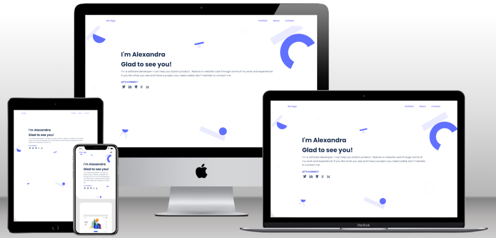

# Portfolio_website
# Desktop version

- (This is a microverse project base learning project and I work with my coding partners and get some feedback from code reviewers. To prove that i can build landing page with html, css , javascript and bootstrap.)

## Build with
- Html
- Css
- Form
- Flexbox
- Figma
- Formspree service
- (RWD) responsive web design using media query
- Animation and Transition
- Use gitHub pages
- Check the accessibility for this portfolio
- Use the js DOM to close the mobile while clicking at the humburger icon
- Use the javascript objects and arrays to store the data for every project

## 🚀 Live Demo 

Click here to see the [Live Demo](https://soesandarwin2201.github.io/portfolio-website-soesandarwin2201.github.io/) of the website 

 ## Soe sandar Win

 -Github : [Soe Sandar Win] (@https://github.com/soesandarwin2201)
 -Twitter: @SoeSand14306315
 
 ## Contributing
 - Contributions, issues, and feature requests are welcome!

   Feel free to check the issues page.
   
 #Show your support
 
 Give a ⭐️ if you like this project!
 

